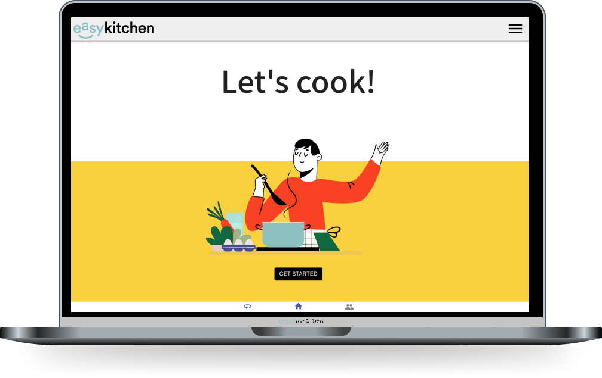

<p align="center">
 
</p>


## About

easyKitchen is an application that allows amateur chefs to offer delivery service. The application has two views, one in which chefs can create daily menus as well as track orders, and the other where clients can view the offers and create orders.

<p align="center">
 
</p>


## Tech Stack

This project was built using [React.js](https://reactjs.org/) on the frontend and [Node.js](https://nodejs.org), [Express](http://expressjs.com/), [Sequelize](https://sequelize.org/) and [PostgreSQL](https://www.postgresql.org/) on the backend.

<p align="center">
 
</p>


## Running easyKitchen
1. Clone the repo
```
git clone <link>
cd easyKitchen
```

2. Install server dependencies
```
cd server
npm install
```
3. Create your database related variables in a .env file under 'server' folder, using the 'config.js' file under 'server/config' for a list of required variables. Your .env file should look like below. Don't forget to add this file to your gitignore!
  ```
DB_USER=**your database username**
DB_PASSWORD=**your db password**
DB_NAME=**your db name**
DB_DIALECT="postgres"
DB_HOST=**your db host, ex: localhost**
DB_PORT=**your db port, ex: 3001**
NODE_ENV=**one of environments used in config.js file**
DB_TEST=**db name for test environment as an example**
TEST_PORT=**db port for test environment as an example**
  ```
4. You can run your server using nodemon to watch for changes  
☝️ *(before running the server, verify that the database is active)*
```
nodemon
```

5. Install client dependencies
```
cd ../client
npm install
```
6. Run your react app
```
npm start


